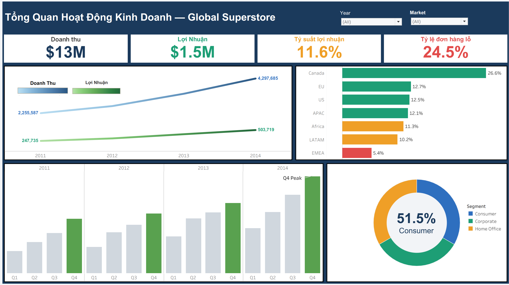
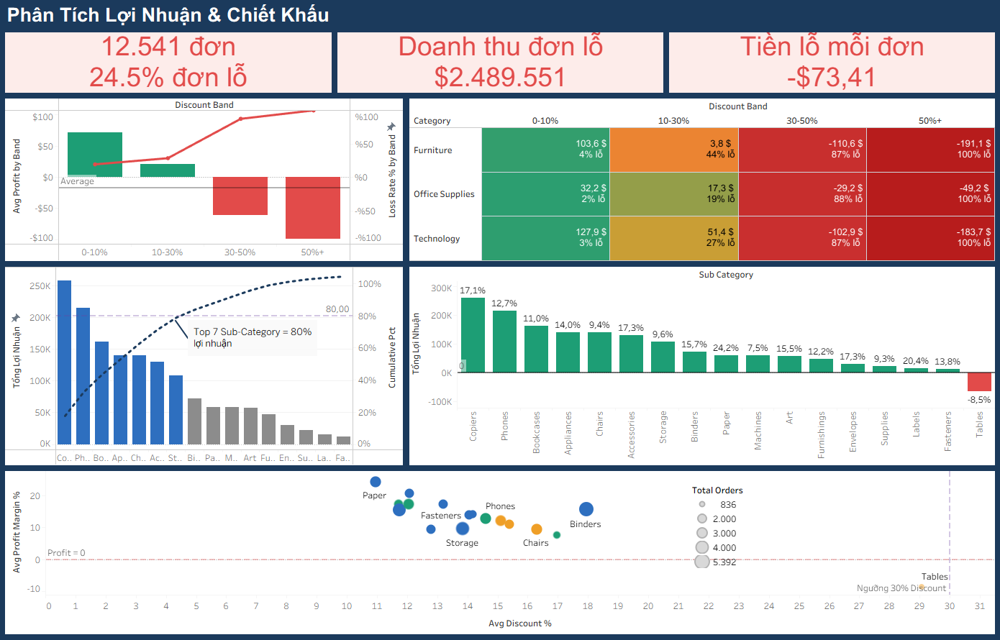
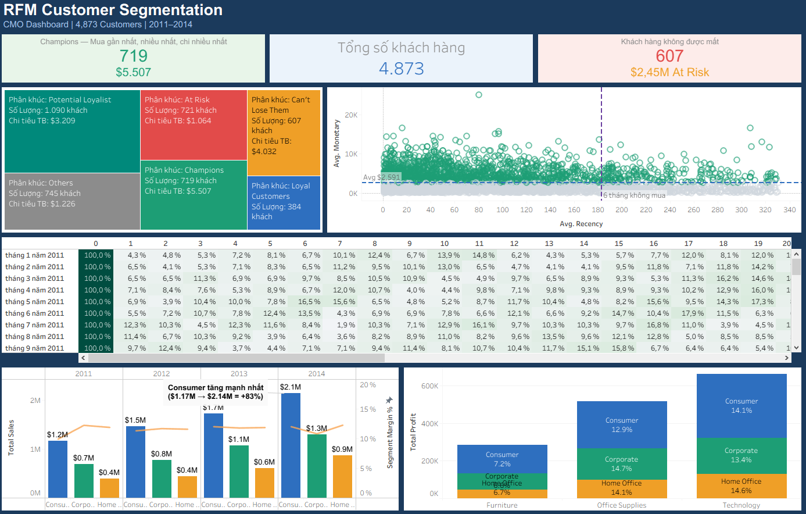

<div align="center">

#  Global Superstore Analytics Pro

### Hệ thống phân tích hiệu quả kinh doanh bán lẻ toàn diện — từ raw data đến Dashboard tương tác

[](https://python.org)
[](https://pandas.pydata.org)
[](https://tableau.com)
[](LICENSE)
[]()

<br/>

> **"Doanh thu liên tục lập đỉnh, nhưng lợi nhuận thực sự đi về đâu?"**  
> Dự án bóc tách sự thật ẩn sau 51,252 giao dịch — phát hiện bẫy giảm giá, điểm đen lợi nhuận và phân khúc khách hàng VIP.

</div>

---

##  Mục lục

- [Tổng quan dự án](#-tổng-quan-dự-án)
- [Phát hiện chính](#-phát-hiện-chính-key-findings)
- [Kiến trúc hệ thống](#-kiến-trúc-hệ-thống)
- [Dashboard](#-dashboard)
- [Cấu trúc thư mục](#-cấu-trúc-thư-mục)
- [Hướng dẫn cài đặt](#-hướng-dẫn-cài-đặt--chạy)
- [Dữ liệu đầu ra](#-dữ-liệu-đầu-ra)
- [Kết quả phân tích](#-kết-quả-phân-tích)
- [Nhóm thực hiện](#-nhóm-thực-hiện)

---

##  Tổng quan dự án

Dự án xây dựng một **Data Pipeline hoàn chỉnh** phục vụ phân tích hoạt động kinh doanh của chuỗi bán lẻ toàn cầu, giải quyết 4 vấn đề cốt lõi mà hầu hết doanh nghiệp bán lẻ đang đối mặt:

| # | Vấn đề | Giải pháp |
|---|--------|-----------|
| 1 | Thiếu cái nhìn tổng quan đa chiều về tăng trưởng | Executive Dashboard với YoY Analysis |
| 2 | Lợi nhuận âm ẩn sau doanh thu khổng lồ | Phân tích Profitability & cờ `is_loss_maker` |
| 3 | Lạm dụng giảm giá không kiểm soát | Discount Trap Analysis — ngưỡng cảnh báo 30% |
| 4 | Thiếu chiến lược phân khúc khách hàng | Mô hình RFM tự động phân 7 nhóm khách hàng |

###  Dataset

| Tiêu chí | Giá trị |
|----------|---------|
| **Nguồn** | [Global Superstore — Kaggle](https://www.kaggle.com/datasets/fatihilhan/global-superstore-dataset) |
| **Quy mô** | 51,290 bản ghi giao dịch |
| **Thời gian** | 4 năm tài chính (2011 – 2014) |
| **Phạm vi** | 7 Markets toàn cầu (APAC, EU, US, LATAM, EMEA, Africa, Canada) |
| **Danh mục** | Furniture · Office Supplies · Technology |

---

##  Phát hiện chính (Key Findings)

<table>
<tr>
<td width="50%">

###  Bẫy giảm giá (Discount Trap)

| Mức Discount | Lợi nhuận TB | Tỷ lệ lỗ |
|-------------|-------------|----------|
| 0 – 10% | **+$62.56** | 2.7%  |
| 10 – 30% | **+$21.00** | 28.5%  |
| 30 – 50% | **-$61.56** | 87.4%  |
| 50%+ | **-$98.89** | ~100%  |

>  **4,172 đơn hàng** discount >50% gây thiệt hại ước tính **~$412,000** trong 4 năm.

</td>
<td width="50%">

###  Phân khúc RFM (4,873 khách hàng)

| Nhóm | Số KH | Monetary TB |
|------|-------|------------|
|  Champions | 719 | $5,507 |
|  Loyal | 384 | $2,048 |
|  Potential Loyalist | 1,090 | $3,209 |
|  Can't Lose Them | 607 | $4,032 |
|  At Risk | 721 | $1,064 |
|  Lost | 607 | $422 |

>  **"Can't Lose Them"** — 607 KH chi tiêu $4,032/người nhưng im lặng **>300 ngày** — LTV tiềm năng **~$2.4M**.

</td>
</tr>
</table>

###  Tăng trưởng YoY (2011–2014)

```
Doanh thu:  $2.26M → $4.30M   (+90% trong 4 năm)
Lợi nhuận:  $247K  → $504K    (+103%)
Profit Margin: 10.98% → 11.72% (chỉ tăng +0.74%)

 Chi phí đang tăng gần bằng tốc độ tăng doanh thu — cần tối ưu khẩn.
```

---

##  Kiến trúc hệ thống

```
┌─────────────────────────────────────────────────────────────────┐
│                      DATA PIPELINE (6 LAYERS)                   │
├──────────┬──────────┬───────────────┬──────────┬───────────────-┤
│  Layer 1 │  Layer 2 │    Layer 3    │ Layer 4  │    Layer 5     │   Layer 6    │
│  Source  │  Explore │  Transform &  │  Model   │  Aggregate     │   Visualize  │
│          │          │  Engineering  │  (Star   │  (Data Marts)  │  (Tableau)   │
│  Raw CSV │  eda.py  │  cleaner.py   │ Schema)  │  aggregate.py  │  Dashboard   │
│ 51,290 ↓ │  Stats   │  RFM · Cohort │splitter.py│  10 CSV files │  Interactive │
└──────────┴──────────┴───────────────┴──────────┴────────────────┴──────────────┘
                              ↓  ~8 giây  ↓
                    python main.py  →  16 file CSV sẵn sàng
```

### Star Schema

```
                    ┌──────────────┐
                    │  dim_time    │
                    │  (1,430 rows)│
                    └──────┬───────┘
                           │
┌──────────────┐    ┌──────┴───────┐    ┌──────────────┐
│ dim_customer │────│  fact_sales  │────│ dim_product  │
│  (4,873 rows)│    │ (51,252 rows)│    │(10,768 rows) │
└──────────────┘    └──────┬───────┘    └──────────────┘
                           │
                    ┌──────┴───────┐
                    │ dim_location │
                    │  (3,819 rows)│
                    └──────────────┘
```

---

##  Dashboard

> Dashboard được xây dựng trên **Tableau Desktop** với tính năng Parameter Actions, Drill-down và Filter động.

### Dashboard 1 — Executive Overview



*Tổng quan tăng trưởng YoY, Profit Margin theo Market và xu hướng doanh thu 4 năm.*

---

### Dashboard 2 — Discount & Profitability Analysis



*Phân tích tác động của Discount lên lợi nhuận — xác định ngưỡng cảnh báo và các Sub-Category gây lỗ.*

---

### Dashboard 3 — RFM Customer Segmentation



*Bản đồ phân khúc 4,873 khách hàng theo mô hình RFM — Treemap + Scatter plot tương tác.*

---

### Dashboard 4 — Cohort Retention Analysis


*Heatmap ma trận giữ chân khách hàng theo tháng — phát hiện điểm rơi tỷ lệ retention.*

> 📁 File Tableau: [`dashboards/Final_Superstore_Story.twbx`](dashboards/Final_Superstore_Story.twbx)

---

##  Cấu trúc thư mục

```
Superstore-Analytics-Pro/
│
├──  data/
│   ├── raw/                        # Dữ liệu gốc — BẤT KHẢ XÂM PHẠM
│   │   └── Global_Superstore.csv
│   ├── cleaned/                    # Output của cleaner.py
│   │   ├── superstore_cleaned.csv  # 51,252 dòng · 29 cột
│   │   └── rfm_base.csv            # 4,873 khách hàng · R/F/M
│   ├── dim_fact/                   # Star Schema
│   │   ├── dim_customer.csv
│   │   ├── dim_product.csv
│   │   ├── dim_location.csv
│   │   ├── dim_time.csv
│   │   └── fact_sales.csv
│   └── aggregates/                 # 10 Data Marts cho Tableau
│       ├── agg_rfm_segments.csv
│       ├── agg_cohort_retention.csv
│       ├── agg_product_pareto.csv
│       ├── agg_yoy_growth.csv
│       ├── agg_discount_impact.csv
│       ├── agg_discount_impact_by_category.csv
│       ├── agg_shipping_analysis.csv
│       ├── agg_shipping_by_priority.csv
│       ├── agg_market_performance.csv
│       ├── agg_segment_performance.csv
│       └── agg_segment_by_category.csv
│
├── src/
│   ├── main.py          #  Điểm chạy chính — 1 lệnh duy nhất
│   ├── config.py        #  Trung tâm cấu hình (đọc từ .env)
│   ├── eda.py           #  Phân tích khám phá dữ liệu
│   ├── cleaner.py       #  Làm sạch · Feature Engineering · RFM base
│   ├── splitter.py      #  Chuyển đổi sang Star Schema
│   └── aggregate.py     #  Tạo 10 Data Marts
│
├── dashboards/
│   └── Final_Superstore_Story.twbx
│
├── docs/
│   ├── images/          # Screenshots dashboard
│   └── Báo_cáo_chính.docx
│
├── .env                 # Cấu hình tham số (không commit lên git)
├── .env.example         # Template cấu hình mẫu
├── requirements.txt
└── README.md
```

---

##  Hướng dẫn cài đặt & chạy

### 1. Clone repository

```bash
git clone https://github.com/<your-username>/superstore-analytics-pro.git
cd superstore-analytics-pro
```

### 2. Tạo môi trường ảo & cài thư viện

```bash
python -m venv venv
source venv/bin/activate        # Linux/macOS
# venv\Scripts\activate         # Windows

pip install -r requirements.txt
```

### 3. Cấu hình tham số

```bash
cp .env.example .env
# Chỉnh sửa .env nếu cần (ngưỡng discount, RFM bins, ...)
```

```ini
# .env
START_DATE=2012-01-01
END_DATE=2015-12-31
SNAPSHOT_DATE_OFFSET=1
RFM_BINS=5
MAX_DISCOUNT_THRESHOLD=0.8
MIN_PROFIT_MARGIN_WARNING=-0.5
```

### 4. Đặt dữ liệu gốc

```bash
# Tải từ Kaggle: https://www.kaggle.com/datasets/fatihilhan/global-superstore-dataset
cp Global_Superstore.csv data/raw/
```

### 5. Chạy pipeline

```bash
# Chạy đầy đủ (EDA + Clean + Star Schema + Data Marts) — ~8 giây
python src/main.py

# Bỏ qua EDA, chạy nhanh hơn
python src/main.py --skip-eda

# Chỉ chạy lại Data Marts (khi sửa aggregate.py)
python src/main.py --only-agg
```

### 6. Kết nối Tableau

Mở Tableau Desktop → Connect to File → chọn các file CSV trong `data/aggregates/` và `data/dim_fact/`.

---

##  Dữ liệu đầu ra

### Pipeline Output (16 files)

| File | Mô tả | Dòng |
|------|-------|------|
| `superstore_cleaned.csv` | Dữ liệu đã làm sạch, 29 cột | 51,252 |
| `rfm_base.csv` | Điểm R/F/M từng khách hàng | 4,873 |
| `dim_customer.csv` | Dimension khách hàng | 4,873 |
| `dim_product.csv` | Dimension sản phẩm | 10,768 |
| `dim_location.csv` | Dimension địa lý | 3,819 |
| `dim_time.csv` | Dimension thời gian (8 thuộc tính) | 1,430 |
| `fact_sales.csv` | Bảng Fact giao dịch | 51,252 |
| `agg_rfm_segments.csv` | Phân khúc RFM 7 nhóm | 4,873 |
| `agg_cohort_retention.csv` | Ma trận giữ chân KH (long format) | 2,304 |
| `agg_product_pareto.csv` | Phân tích 80/20 theo sub-category | 17 |
| `agg_yoy_growth.csv` | Tăng trưởng YoY theo Market | 32 |
| `agg_discount_impact.csv` | Tác động Discount lên lợi nhuận | 4 |
| `agg_shipping_analysis.csv` | Hiệu suất giao hàng | 28 |
| `agg_market_performance.csv` | Hiệu suất 7 Markets | 28 |
| `agg_segment_performance.csv` | Hiệu suất theo Segment | 12 |
| `agg_segment_by_category.csv` | Segment × Category cross-tab | 9 |

---

##  Kết quả phân tích

### Top Sub-Categories theo lợi nhuận (Pareto 80/20)

```
Copiers      ████████████████████  17.66% | $258,568
Phones       ████████████████      14.72% | $215,493
Bookcases    █████████████         11.05% | $161,824
Appliances   ████████████           9.61% | $140,752
Chairs       ████████████           9.59% | $140,348
──────────────────────────────────────────────────────
Tables       ██████ (−$64,083)  LOSS MAKER
```

### Hiệu suất 7 Markets

| Market | Doanh thu | Margin | Đánh giá |
|--------|-----------|--------|----------|
| APAC | $3,578,606 | 12.1% |  Dẫn đầu |
| EU | $2,937,071 | 12.7% |  Cân bằng |
| US | $2,295,011 | 12.5% |  Ổn định |
| LATAM | $2,160,712 | 10.2% |  Cần tối ưu |
| EMEA | $806,145 | **5.4%** |  Điều tra khẩn |
| Canada | $66,932 | **26.6%** |  Margin cao nhất |

---

## 🛠 Tech Stack

| Lớp | Công nghệ | Lý do chọn |
|-----|-----------|------------|
| **Xử lý dữ liệu** | Python 3.10+, Pandas, NumPy | Feature Engineering & RFM phức tạp |
| **Lưu trữ** | File-based CSV + Git | Tính di động cao, phù hợp quy mô dự án |
| **Visualization** | Tableau Desktop | Parameter actions, drill-down mạnh mẽ |
| **Cấu hình** | python-dotenv (.env) | Tách biệt config khỏi code logic |
| **Logging** | Python logging | Tracing pipeline có timestamp & level |

---

##  Requirements

```txt
pandas>=2.0.0
numpy>=1.24.0
python-dotenv>=1.0.0
```

```bash
pip install -r requirements.txt
```

---

## 🗺 Roadmap

- [x] **Phase 1** — Data Pipeline, Star Schema, RFM Segmentation, Dashboard 
- [ ] **Phase 2** — Time Series Forecasting (ARIMA/Prophet)
- [ ] **Phase 2** — Churn Prediction (Random Forest)
- [ ] **Phase 3** — Automated ETL Pipeline (Airflow)
- [ ] **Phase 3** — Advanced Clustering (K-Means thay RFM rule-based)

---

##  Nhóm thực hiện

| Thành viên | Vai trò chính |
|------------|--------------|
| **Sang** | Project Lead · EDA · Báo cáo |
| **Sáng** | Data Analysis · RFM Logic · Báo cáo |
| **Thuần** | Python Pipeline · Feature Engineering · Dashboard |
| **Ân** | Data Cleaning · Tableau Visualization |
| **Huy** | Star Schema · Aggregate · Testing |
| **Hân** | Cohort Analysis · RFM · Dashboard Design |

---

##  License

Dự án được phát hành theo giấy phép [MIT](LICENSE).  
Dataset thuộc về [Fatih İlhan](https://www.kaggle.com/datasets/fatihilhan/global-superstore-dataset) — Kaggle.

---

<div align="center">

**Nếu dự án hữu ích, hãy để lại một Star!**

*Đồ án tốt nghiệp · Phân tích Dữ liệu Bán lẻ · 2026*

</div>
